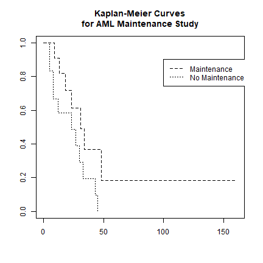
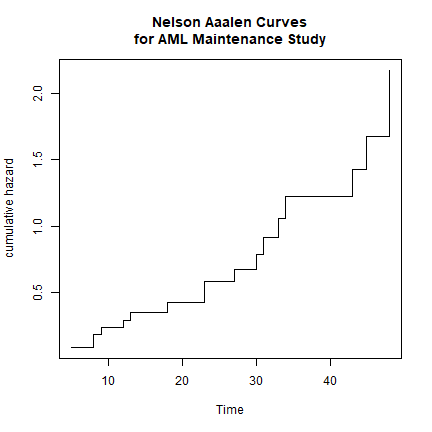
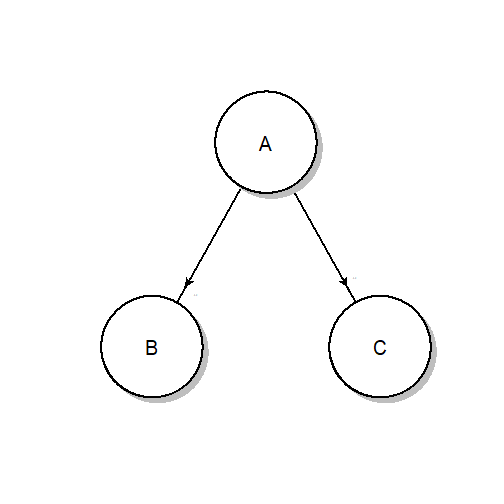
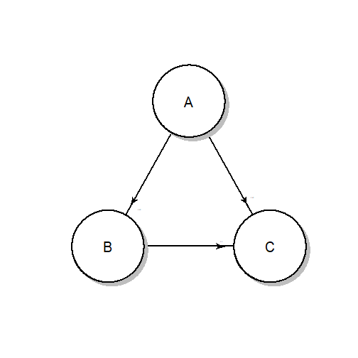
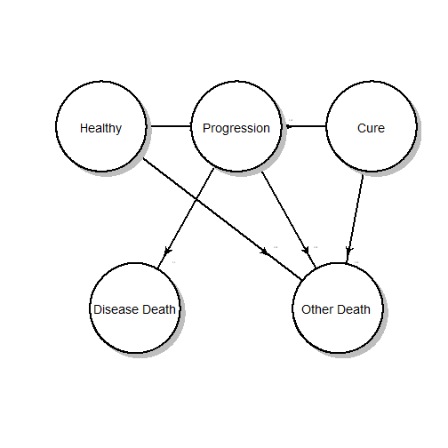

Survival analysis in decision modeling
========================================================
author: The DARTH Workgroup
date: 16 October 2019
autosize: true

petros.pechlivanoglou@sickkids.ca

Overview
=======================================================
- Motivation and introduction in Survival analysis
- Survival modeling
- Partitioned survival modeling
- Multistate models
- Advanced topiics
  - Mixture cure models 
  - External evidence in survival models

It's all about the data!
========================================================
  - RCT evidence often not sufficient for Health Technology Assesment (HTA)
    - Short follow up
    - Patients lost during follow up
    - Often not reflective of real world
    - Right skewed  
    - Information "flowing" over intervals
    - Extrapolation often necessary

 Bonus challenges in Oncology RCTs
========================================================

 - Overall Survival (OS), Progression-Free Survival (PFS)
 - Trials powered to show differences on PFS and not OS
 - Cross-over
 - PFS and OS data are correlated
 - Access to patient level OS data not always the case
 
Censoring
========================================================

What is survival analysis
========================================================
 - Set of statistical methods that can handle:
   - Data skewness
   - Censoring
   - (Time-dependent) Covariates
   - State transition processes
   - Recurrent events
   - The expectation of cure

 - Used for both inference and extrapolation
 
 - Survival: the probability of not experiencing an event unit some time $t$

 $S(t) = Pr(T >t) = 1- Pr(T \leq t)$ 
    

Types of survival analysis models
========================================================
 - Non-parametric models (e.g. Kaplan Meier)
 - Semi-Parametric models (e.g. Cox Proportional Hazard)
 - Parametric models (e.g. Accelerated Failure Time)
 
Non-Parametric models
========================================================
  - Kaplan Meier curves
  

***
  - Nelson Aalen cumulative hazard 
  

Semi- Parametric models
========================================================
- Cox proportional hazard model
  - Hazard: the instantaneous risk of an event at time $t$, conditional on survival to that time.
- Semi:
  - Baseline hazard modelled non parametrically (i.e effect of time)
  - Covariate effects ( $\beta$ 's) modelled parametrically (like in a regression model)

Fully Parametric models
========================================================
 - Usually model time-to-event directly rather than hazard 
 - Resemble a regression model but can capture censoring
 - Fit a distribution to the (observed) time-to-event data
    - 1 parameter :  exponential
    - 2 parameter : Weibull, lognormal, gamma etc
    - 3, 4 parameter: Gen. gamma , Gen F etc
 - Assumption that censored patients will follow similar patterns to the observed.
 - Temporal extrapolation possible !
 
Choosing the "right" distribution
========================================================
- Statistical considerations of goodness-of-fit
- Clinical plausibility
    - in-sample
    - extrapolations
    - out-of-sample

    
Goodness of fit metrics
========================================================
 - Likelihood based metrics 
  - Akaike Information Criterion (AIC) 
  - Bayesian Information Criterion (BIC)
  
 - Performance based metrics
  - Sensitivity , Specificity
  - (time dependent) Receiver Operating characteristic (ROC) curve
  - Area Under the Curve (AUC) 
  - c- statistic
  
Choosing the "right" distribution
========================================================
 - NICE Decision Support Unit
  - Latimer et al 2011 : Survival Analysis For Economic Evaluations Alongside Clinical Trials - Extrapolation with Patient-Level Data
    - **Survival Model Selection Process algorithm**: 
      - *recommendations for how survival analysis can be undertaken more systematically. This involves fitting and testing a range of survival models and comparing these based upon internal validity (how well they fit to the observed trial data) and external validity (how plausible their extrapolated portions are)*

Choosing the "right" distribution
========================================================
Latimer et al 2011 (DSU 14)

Flexible Survival models 
========================================================
Multi - parameter distributions
  - Generalized Gamma - Generalized F
  
  Data hungry -  possibiliy of overfitting  
  Hypothesis testing possible

Spline Survival models 
========================================================
 Survival models where the underlying hazard of an event is modelled as a smooth, piecewise polynomial function of time. 
- Extrapolation of hazard possible
- Non-linear relation of time and hazard
- Conventionally *knots* are evenly spread on the (log)-time axis
- Overfitting with too many knots possible -sensitivity analysis
- AIC, BIC valid GoF tests 

Spline Survival models 
========================================================
Gibson et al (Pharmacoeconomics, 2017)  

Spline Survival models 
========================================================
From Gibson et al (Pharacoeconomcs, 2017)

*Spline-based models using a limited number of knots can provide an acceptable fit to trial data and generate extrapolated estimates supported by longer term evidence, with results that are stable in response to changes in knot placement.*

Approaches in extrapolation
========================================================

Modeler faced with a more decisions:
 - Extrapolate using KM and "fitted" tails 
 - Extrapolate using the fitted curve
 
 - Fit seperate curves to the data
 - Extrapolate treatment effect as relative
  - What is the behaviour of the relative effect post trial?

Approaches in extrapolation
========================================================

Approaches in extrapolation
========================================================
 - Extrapolate using KM and "fitted" tails 
 
 
 ***
  - Extrapolate using the fitted curve

 
Extrapolating a relative treatment effect
========================================================
Drummond, et al (2015). Methods for the economic evaluation of health care programmes. Oxford university press.

Partitioned survival models
========================================================

- Form of a decision model that:
  - Considers evidence of (usually) OS and PFS
  - allocates the cohort across pre-progression, post-progression, death
- PFS and OS are modeled independently

*** 

Partitioned survival models
========================================================

Mechanics:
  - Remain pre-progression: p(PFS)
  - Remain dead:   1 – p(OS)
  - Progressed: p(OS) - p(PFS)

Implicit assumption: risk of dying is only a function of   time

*** 

Less problematic with less censoring

Partitioned survival models - the updside
========================================================
- Intuitively appealing
- Easy to communicate
- Easy to construct
- In-sync with what is commonly reported in RCTs
- Can be constructed using aggregate / graphic based data
- In-sync with methods of cross-over
- PSMs work great for cases where the whole cohort is observed until event of interest (unlikely in the vast majority of the cases)

Partitioned survival models - the downside
========================================================
- OS and PFS are falsely assumed independent
- Cohort cannot transition back to a healthier state.
- 3-state PSM cannot distinguish the origin of the cohort moving to the dead
state (progresed -> death vs preprogession -> death)
- In the presence of censoring:
  - Projected trajectory of state occupancy after end of follow up only informed by the observed trajectory
  - Poor performance when trends in the within trial period may not continue in the extrapolation period

Partitioned survival models - the criticism
========================================================
Woods et al 2017 (DSU 19)

***
Williams et al 2017 (MDM)

Competing Risks
========================================================

  - Underlying assumption in survival analysis: 
    - If we could follow censored individuals long enough they would experience the event of interest.
 - Event B (progression) affecs population size at risk for the competing event C

***

Multistate modeling 
========================================================
 - Extended form of competing risks
 - Multivariate survival analysis
 

Multistate modeling 
========================================================
- Extended form of competing risks
- Multivariate survival analysis
- Can incorporate:
  - Transition specific covariates
  - Recurrent events 
  
- Can work with 
  - Patient-level data (best)
  - Digitized / interval censored data (...not best)

Multistate modeling
========================================================
Fitted in two ways:

1. separate models for each trasition
  - recurrent events 
  - covariates
  - seperate dataset for each (non-saturating) state
  - "naive" assumption of censoring when competing event occurs
  - easy to fit in R `flexsurv` and `mstate`

Multistate modeling
========================================================
Fitted in two ways:

2. Joint multivariate model for all transitions - Powerfull!
    - Mislclassification errors
    - Latent states 
    - Interval censoring
    - Continuous time
    
Drawbacks:
 - Difficult to converge
 - Limited options wrt assumed distributions (exponential)

Can be fitted through `msm` and `flexsurv`

 
Multistate modeling
========================================================

Great resource for both survival fitting and multistate models

Multistate & microsimulation
========================================================
- Multistate models allow for time-dependent transition probabilities 
- When dependence on time-in-state partioned survival / markov models are inadequate  
- Necessary solution: Individual level simulation modeling

Multistate modeling
========================================================

Multistate modeling
========================================================

External data and survival models 
========================================================
Given short term follow up in RCTs, survival extrapolations can be informed by external data 

  - Adjustment of all-cause mortality using life-tables
  - Expert opinion on plausibility
  
Other sources of external data:
- longer follow-up on a different RCT
- disease registry
- administrative data

External data and survival models 
========================================================
Observational data
- possibly more representative of the real world
- at risk for (unmeasured) confounding

External data and survival models 
========================================================
{ width=20% } 

Mixture Cure Models - Main Points
========================================================

 - Therapies with the possibility of cure pose a modeling challenge
 - e.g. plateau on immotherapy survival curves 
 - Extrapolation challenging without external information 
 - Traditional methods: Underestimation more likely than over estimation of the effect
 
Mixture Cure Models - Main Points 
========================================================

  - extension of survival models where a proportion of the population is assumed to be "cured" 
    - non-cured fraction at risk of progression and death informed by the trial
    - cured fraction at risk of death informed by external data. 
    

    

 
Mixture Cure Models - Estimation
========================================================
- Cure rate models a promising solution but the cure faction difficult to estimate

- Can be fitted in both R and SAS

- Guidance is lacking but given the popularity soon to come!

Mixture Cure Models - Validity
========================================================

- Paucity of applications in HTA

- Recently shown to be more appropriate than conventional modeling  (n of 1)

Thank you!
========================================================

